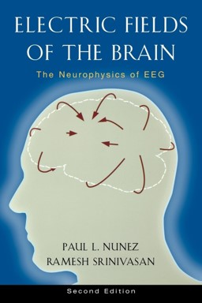
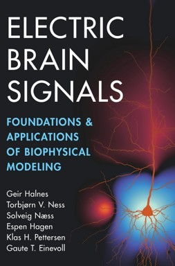
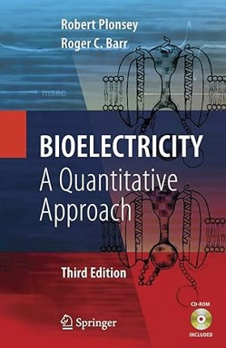

<!-- docs/modules/01_background.md -->
# Module 01 — Background & pre-work

This module is the “on-ramp”: what to skim before the workshop, plus a short checklist so you can follow the hands-on parts smoothly.

## Pre-work reading
[**Guide to Research Techniques in Neuroscience**](https://www.sciencedirect.com/book/monograph/9780128005118/guide-to-research-techniques-in-neuroscience)
- **Chapter 3** — *Stereotaxic Surgeries and In Vivo Techniques*
- **Chapter 4** — *Electrophysiology*
- **Chapter 8** — *Manipulating Neural Activity*  

**Books on electric fields, biopotentials** 

  
  
  

  

[**The Biomedical Engineering Handbook**](https://biblioseb.wordpress.com/wp-content/uploads/2018/03/biomedical-engineering-handbook-j-d-bronzino.pdf)
  - **Section II**
  - **Section V**
  - **Chapter 70**  

**Review Articles**
[In vivo microelectrode arrays for neuroscience](https://www.nature.com/articles/s43586-025-00399-7) 
[Microelectrodes, Microelectronics, and Implantable Neural Microsystems](https://ieeexplore.ieee.org/document/4545308) 
[State-of-the-art MEMS and microsystem tools for brain research](https://www.nature.com/articles/micronano201666) 
[The origin of extracellular fields and currents — EEG, ECoG, LFP and spikes](https://www.nature.com/articles/nrn3241)  

## What you should be able to answer after this module
- What “extracellular electrophysiology” measures (and what it does *not* measure).
- The difference between **acute** and **chronic** recordings.
- The purpose of **ground vs reference** (high-level intuition only — details later).
- The main “moving parts” of a modern ephys experiment (probe → headstage → DAQ → sync).

## Repo navigation
- Next: [Module 02 — History](02_history.md)
- **Slides (PDF):** [slides/Electrophysiology_Workshop.pdf](slides/Electrophysiology_Workshop.pdf)
