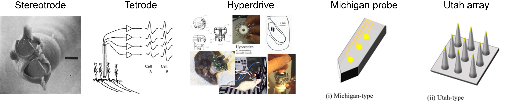

<!-- docs/modules/02_history.md -->
# Module 02 — A short history of extracellular recording

This module gives you a fast timeline for *why* modern systems look the way they do.

## Big picture
- **Intracellular** recording drove early biophysics: resting potential, AP shape, synaptic potentials.
- **Extracellular** recording enabled stable, long-duration single-unit recordings, chronic implants, and eventually large-scale population recordings.

## “Worth watching” resource
- Professor Ken Wise: [The Rocky Road to Neurotechnology](https://www.youtube.com/watch?v=G5mfF5yV_lA)
- [Neuronexus: “A brief history of electrode technology”](https://www.neuronexus.com/a-brief-history-of-electrode-technology/)

## Timeline highlights
### 1930s–1950s: “Intracellular revolution”
- Glass micropipettes
- Mostly acute, stationary preparations
- Key outcomes: resting potential, AP waveform, synaptic potentials

### 1953: Metal-filled glass micropipette
- Dowben & Rose (Science) *(as noted in the deck)*

### 1957: Tungsten microelectrode
- Hubel (Science) *(as noted in the deck)*
- Reliable single units, moving toward chronic-ish in vivo recordings

### 1958: Microwire bundles & chronic implants
- Strumwasser (steel), Olds (nichrome) *(as noted in the deck)*
- Long-term single units in unrestrained animals

### 1980s–1990s: Multi-unit isolation upgrades
- **Stereotrode** (1983) — simultaneous isolation of multiple units
- **Tetrode** (1993)
- **Hyperdrive** (Bruce McNaughton) (1990-)
- **Michigan vs UTAH probe** (1990-)  
  

### 2000s–2020s: Channel count explosion
- Large-scale recordings become routine
- Flexible probes, opto-capable probes, and high-density silicon technology accelerate adoption
  - [**Neuropixels**](https://www.neuropixels.org/)
  - [**SiNAPS (1024-channel)**](https://advanced.onlinelibrary.wiley.com/doi/10.1002/advs.202416239)
  - [**Hecto-STAR**](https://advanced.onlinelibrary.wiley.com/doi/full/10.1002/advs.202105414)
  - Flexible probes 
  - Opto-flex probes

## Why this history matters (practical takeaways)
- Many “modern” problems are old problems in new form:
  - **Noise pickup** (EMI), grounding/reference confusion
  - Mechanical stability vs tissue damage
  - Chronic stability vs unit yield decay
- Tool choices today reflect tradeoffs people have been optimizing for decades:
  - unit yield vs coverage
  - chronic stability vs surgical complexity
  - modularity vs robustness

## Repo navigation
- Next: [Module 03 — System overview](03_system_overview.md)
