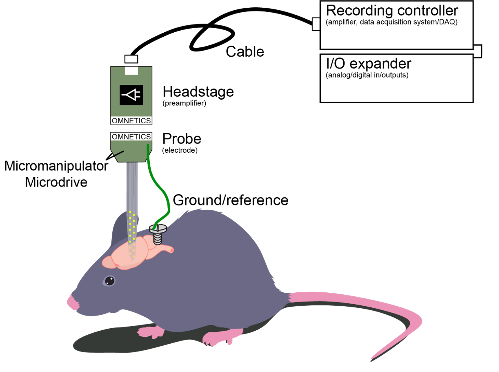

<!-- docs/modules/03_system_overview.md -->
# Module 03 — Parts of an extracellular ephys system

This module is a “systems diagram in words”: what each component does, and what usually breaks first.

## The parts
| | |
|---|---|
| <ol><li>Recording probe / electrode / device</li><li>Microdrive / shuttle / drive / manipulator</li><li>Headstage / preamp / amplifier</li><li>Recording cable</li><li>Recording device / DAQ</li><li>I/O expander + analog/digital inputs (sync + behavior integration)</li><li>Ground, reference</li></ol> |  |

## What each part is responsible for

### 1) Probe / electrode
- Converts local extracellular voltage into a measurable signal.
- Practical constraints: geometry, site density, shank length, tissue damage, chronic stability.

### 2) Microdrive / shuttle / manipulator
- Provides controlled motion and/or stable mounting.
- Core role in chronic work: compensate for unit loss / drift by advancing the probe over time.

### 3) Headstage (preamp/amplifier)
- Buffers and amplifies signals close to the animal to reduce noise susceptibility.
- Often where payload constraints become real (weight, stiffness, connector reliability).

### 4) Cable
- Provides connection from headstage to acquisition hardware.
- Common failure modes: motion artifacts, connector wear, strain relief issues, intermittent contacts.

### 5) DAQ / recording device
- Digitizes signals; defines sampling rate, bandwidth, channel count, and sometimes onboard filtering.
- Also defines the software ecosystem you’ll live in.

### 6) I/O + analog/digital inputs (synchronization)
- Everything that lets you align neural data with:
  - behavior cameras
  - tracking (e.g., DLC/SLEAP)
  - stimulation (opto, electrical)
  - reward/valves/TTL events
- If sync is wrong, the whole experiment can become “unusable”.

### 7) Ground and reference
- Usually the most confusing topic, and the most “lab-specific”.
- Goal: stable baseline + minimize EMI and movement artifacts.

## A simple “debug order” (rule of thumb)
When something looks wrong, check in this order:
1. Ground/reference sanity
2. Cable + connectors (wiggle test)
3. Headstage seating/contacts
4. DAQ settings (gain, sampling, filters)
5. Probe integrity / mechanical issues

## Repo navigation
- Next: [Module 04 — Probes](04_probes.md)
