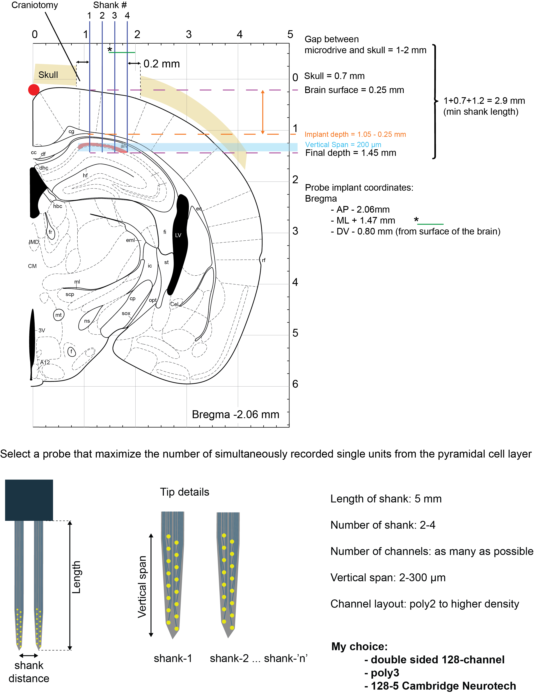
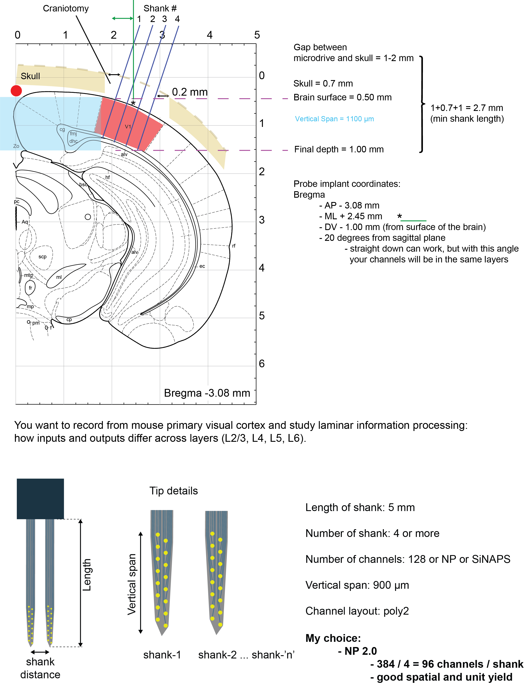
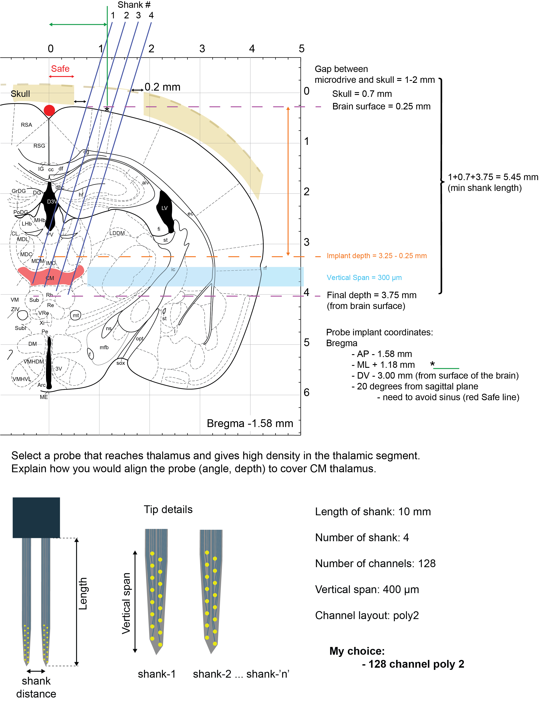
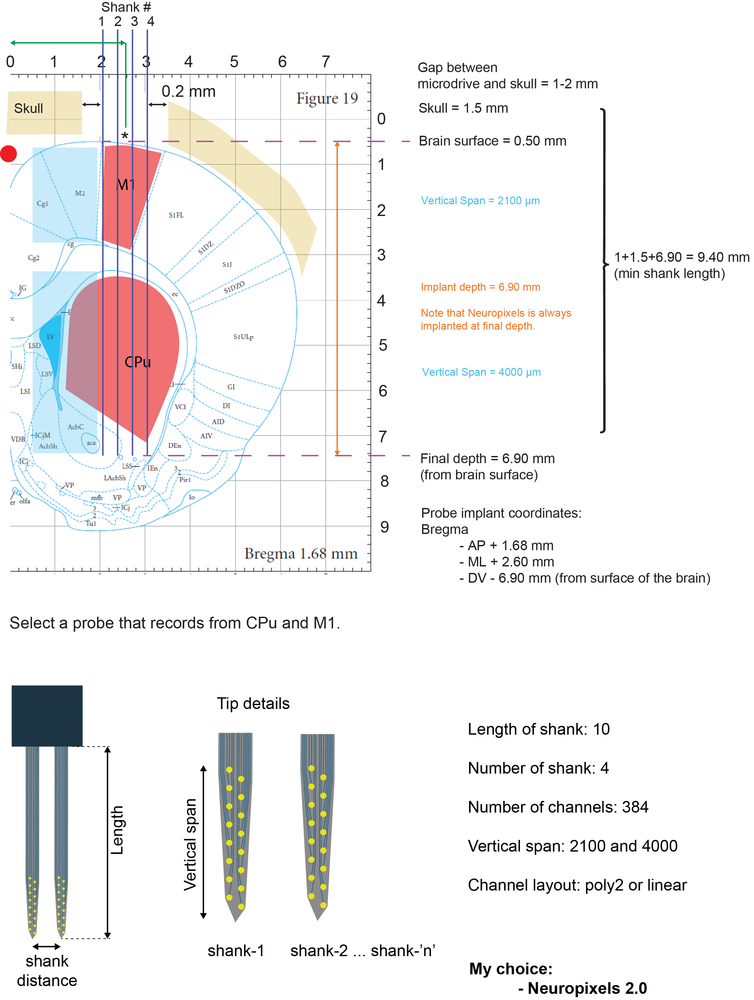

<!-- docs/modules/04_probes.md -->
# Module 04 — Probes: anatomy, types, vendors, and selection

“What kind of probe do I need, and what are the hidden costs?”

## 1) Probe “anatomy”: acute vs chronic

### Acute probe
- No flex cable → typically **very low noise**
- Parallel lines can pick up **EMI**
- Often used in **head-fixed** prep (awake or anesthesia)

### Chronic probe
- Has a **flexible cable** to allow **mechanical decoupling**
- Typically attached to a **microdrive/shuttle**
- Often used in **freely moving** prep
- Can also be used head-fixed

## 2) Payload reality check
- Mouse weight: ~20–30 g
- Rule of thumb noted: up to ~20% of body weight can be carried (but this is *not* a free pass — behavior and welfare matter)

### Passive vs active probes
- Passive probe: ~0.6–0.8 g
- Headstage: ~1.2 g
- Active probe: ~0.6–1.2 g
- Example mentioned: MiniAmp (Cambridge)

**Practical message:** “channel count” is not the only constraint — **weight + stiffness + cable mechanics** can dominate behavioral experiments.

## 3) Vendors (Alphabetical order)
- [Cambridge Neurotech](https://www.cambridgeneurotech.com/)
- [IMEC](https://www.neuropixels.org/)
- [NeuroNexus](https://www.neuronexus.com/)
- [Plexon](https://plexon.com/)

## 4) Microdrives / shuttles (just choose one :D)
- Open-source vs commercial
  - “None of the open-source will work” (opinion), with reasons:
    - printer tolerance
    - outdated repos / missing details
    - hidden “secrets” not shown
  - Commercial is ~10× more expensive but:
    - quality control
    - works as intended

Open-source microdrives can be great *starting points*, but expect iteration and troubleshooting. If you need reliability fast, commercial often wins.

## 5) Chronic reality: losing units over time
- “Losing cells over time with Neuropixels”
- Key point: single-unit yield can get worse over days; this happens with silicon probes if you don’t move them → motivating microdrives.

Resource link:
- https://elifesciences.org/articles/59716

## 6) Group exercise
Pick a probe/implant strategy for each:

**Group 1:** Freely moving mouse, dorsal CA1. Maximize simultaneously recorded single units from pyramidal layer.  
**Group 2:** Mouse somatosensory cortex; laminar processing across L2/3, L4, L5, L6.  
**Group 3:** Freely moving mouse, CM thalamus. Maximize unit yield.  
**Group 4:** Freely moving rat, putamen + motor cortex. Maximize unit yield in both.

Suggested structure for answers:
1. Target + geometry constraints (depth, extent, bilateral?)
2. Probe type (acute/chronic, passive/active, shank count)
3. Mounting (fixed vs microdrive)
4. Expected failure mode (unit loss, drift, mechanical damage, payload)
5. What you would measure to declare success

## My Recommendations

**Group 1 — Freely moving mouse, dorsal CA1 (maximize PYR unit yield)**  

**Group 2 — Mouse somatosensory cortex (laminar L2/3–L6 processing)**  

**Group 3 — Freely moving mouse, CM thalamus (maximize unit yield)**  

**Group 4 — Freely moving rat, CPu + M1 (maximize yield in both)**  

## Repo navigation
- Next: [Module 05 — Microdrive vs Neuropixels (unit yield vs coverage)](05_microdrive_vs_neuropixels.md)
