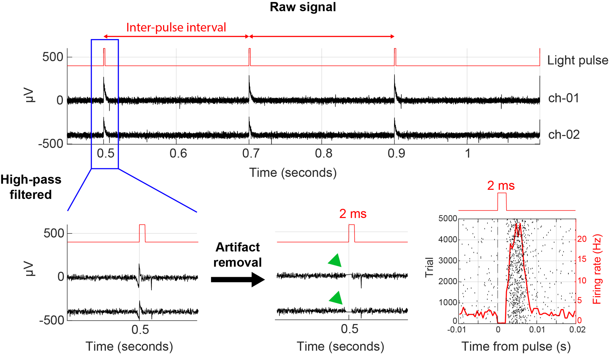

<!-- docs/modules/09_optogenetics.md -->
# Module 09 — Optogenetics during behavior (fiber vs on-head diode, optotagging)

This module covers two distinct goals:
1. **Manipulation** (causal perturbation)
2. **Optotagging** (identifying cell types)

## Delivering light: two common approaches
### A) Patch cable + commutator (fiber)
Pros:
- flexible experimental choices (swap lasers)
- good for stronger powers
Cons:
- torque, tether complexity, commutator failure modes

### B) On-head diode + fiber stub (or direct coupling)
Pros:
- lighter cable (only wires)
- can improve mobility
Cons:
- thermal management, mechanical robustness, power limits

## Optotagging: what “good” looks like
- Low-latency spikes after light onset (opsin-dependent)
- High reliability across trials
- Control for artifacts:
  - photoelectric artifacts on metal
  - stimulus-locked LFP transients
  - network-mediated late spikes (not direct tag)

## Artifact handling (conceptual)
- Avoid interpreting the first milliseconds if there is a sharp optical artifact
- Consider blanking / interpolation around light onset for LFP
- For spikes: validate with latency distribution + reliability metrics

## Exercise
Given spike rasters across many trials:
- compute light-locked latency histogram
- define criteria for “tagged” vs “not tagged”
- discuss false positives (network effects) vs false negatives (weak expression)

## Your notes (local)
- [Optogenetics during behavior: fiber vs on-head diode](../resources/Optogenetics during behavior fiber vs on-head diode.txt)
- [Laser diode for freely moving optogenetics](../resources/Laser_diode_for_freely_moving_optogenetics.pdf)

## Repo navigation
- Next: [Module 10 — Flexible probes](10_flexible_probes.md)
