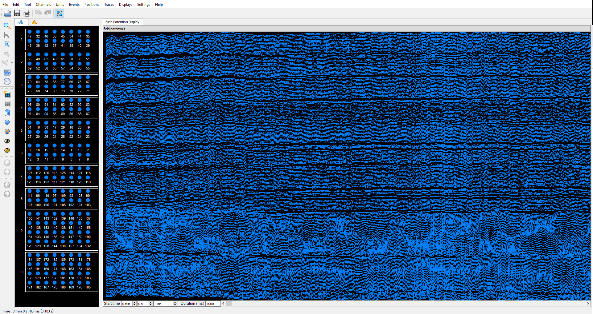

<!-- docs/modules/12_preprocessing_spikesorting.md -->
# Module 12 — Preprocessing & spike sorting

This module is a **high-level checklist** for taking raw extracellular recordings to “sorting-ready” data. The goal is to keep the website readable and put the step-by-step procedure into a reusable MATLAB function.

## Pre-requisite
- You understand how channel maps are created. If not, please do the exercise in **Module 11**.

## Data
- Head-fixed mouse expressing Channelrhodopsin-2 in pyramidal cells is recorded with two probes:
	- 64-15 probe (Diagnostic Biochips) targeting CA1 region of the hippocampus.
	- H2 probe (Cambridge Neurotech) targeting CA3 region of the hippocampus.
- Intan RHD USB Eval system is used to record data at 20 kS/s.
	- port-A: 64-15 probe
	- port-B: H2 probe
	- digital input 0: TTL information for light delivery
- Raw data can be found at [Zenodo](https://zenodo.org/records/18100544).

## Visulization of the data
- Download [Neuroscope](https://neurosuite.sourceforge.net/)
- To visualize a file with Neuroscope, you will need in the same folder:
	- binary '.dat', '.bin', '.lfp', '.eeg' file
	- '.xml' with the same name as your binary file (**see below, how to create one**).  
## Guide for the preprocessing
1) Download the raw data. 
	- Data was collected using the [“One File Per Signal Type” Format](../resources/Intan_RHD2000_data_file_formats.pdf)
		- port-A records: 0-127 channels
		- port-B records: 0-63 channels
2) Create your 'xml' file.
	- Download the [generic_XML.xml](../resources/generic_XML.xml) file.
	- Download the [empty xlsx sheet](../resources/channel_map_empty.xlsx) and create the channel map for this experiment.
	- Channel layout for [64-15 probe](../resources/Dual_Sided_64_1.pdf).
	- Channel layout for [H2 probe](../resources/ASSY_156_H2_map.pdf).
	- Channel layout for Intan RHD 64-channel headstage [top](../resources/RHD2164_BGA_headstage_electrode_connector_top_600.jpg) and [bottom](../resources/RHD2164_BGA_headstage_electrode_connector_bottom_600.jpg) 
	- Copy the final channel map values into sheet2 and use [excel2xml.m](../../code/matlab/excel2xml.m)
		- [pipeline_xml.m](../../code/matlab/pipeline_xml.m) is a good starting point on how to use this function.
	- **Tip:** Don't forget that Neuroscope visualizes channels from 0 to 192.
	- A filled out Excel sheet can be found [here](../resources/channel_map.xlsx).
3) Copy the generated '.xml' file into baseline_220903_153754 folder and rename it **amplifier.xml**.
	- You should see something like this.
	- Note that we have 10 groups of probes.
		- 8 groups for the 64-15 probe (4 shank x 2 sides = 8 groups).
		- 2 groups for the H2 probe (2 shank = 2 groups).  
4) Concatenating raw recording segments into one `.dat`
- Generating an LFP file for fast browsing / sleep scoring
- Building session metadata (channel groups, sampling rate, anatomy notes)
- Parsing digital TTL inputs to define stimulation/manipulation epochs
- Removing stimulation artifacts (linear interpolation windows)
- Reducing global/common-mode noise (median subtraction)
- Optional: sleep scoring and manual correction

## Practical outcomes
After running the tutorial function, you should have:
- A concatenated `.dat`
- A `.lfp` file
- Session metadata saved
- (Optional) `YOURmanipulation.manipulation.mat`
- (Optional) artifact-cleaned `.dat`
- A cleaner dataset for spike sorting

## MATLAB tutorial
Run the preprocessing function from MATLAB:

- [`code/matlab/ephys_preprocess_buzcode.m`](../../code/matlab/ephys_preprocess_buzcode.m)

> Tip: open the `.m` file — the top comment block contains a “quick start” example you can copy-paste.
